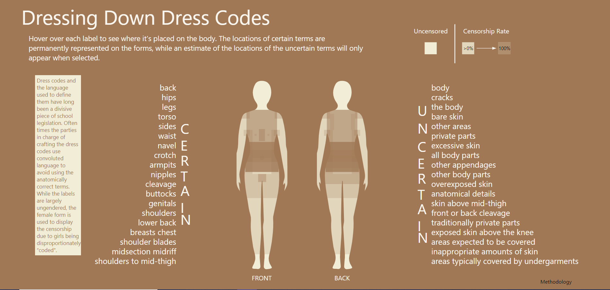

[Home](https://amina-brown.github.io) | [About Me](https://amina-brown.github.io/about_me.html) | [Resume](https://amina-brown.github.io/Resume_01_2021.pdf) | [Projects](https://amina-brown.github.io/projects.html)

## Dressing Down Dress Codes

This project was designed to highlight the uncertain language used in public school dress codes. The idea is to showcase how difficult the uncertain language makes it for students to
identify the "proper" way to dress. It also aims to show which body parts are more censored than others and how schools aim to control the common controversies that have surronded gendered
targetting in the dress codes.

[Launch Project](https://amina-brown.github.io/information-aesthetics/Uncertainties/) | [Documentation](https://github.com/amina-brown/information-aesthetics/tree/gh-pages/Uncertainties)

