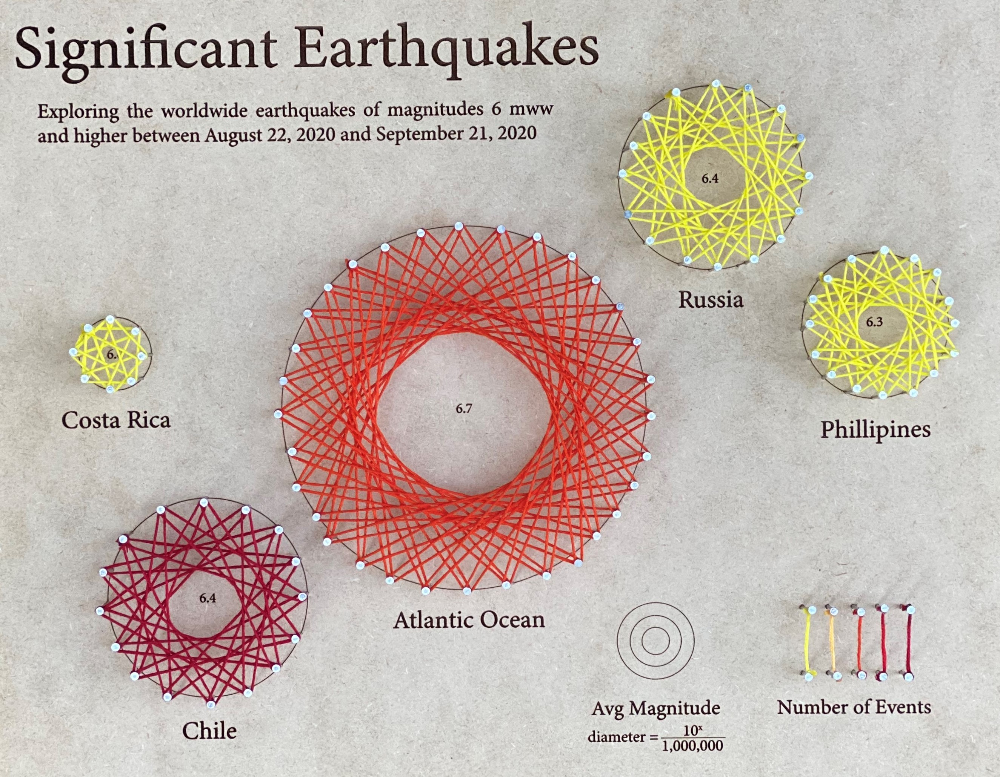
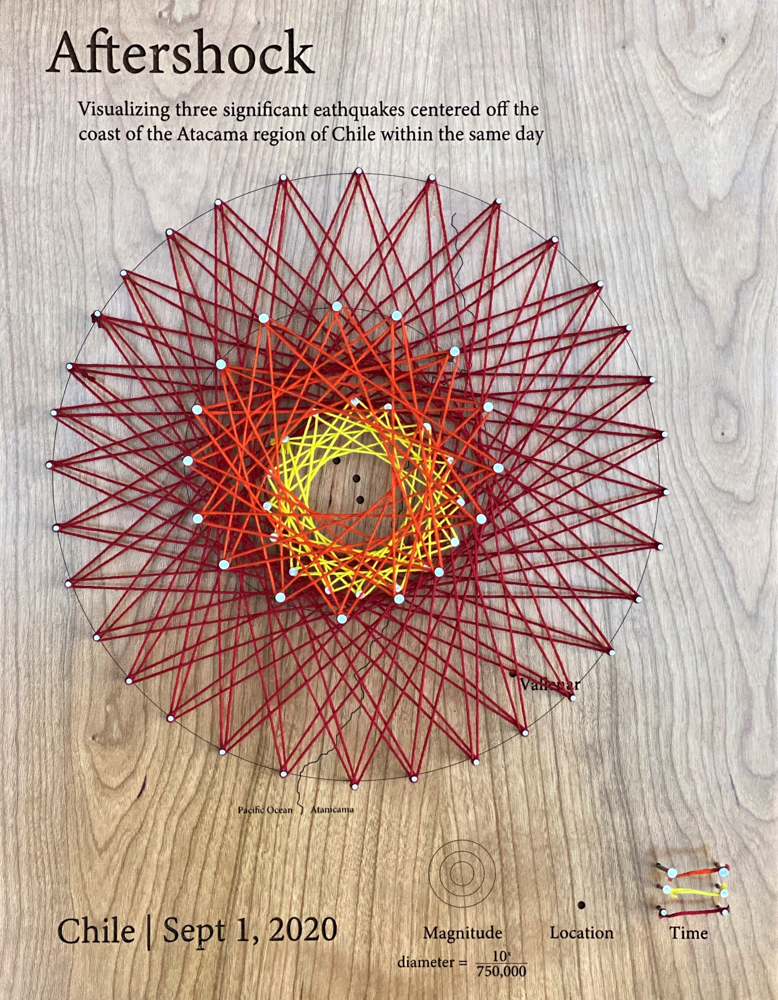

[Home](https://amina-brown.github.io) | [About Me](https://amina-brown.github.io/about_me.html) | [Resume]() | [Projects](https://amina-brown.github.io/projects.html)

## Signficant Earthquakes/Aftershock

These pieces explore the significant earthquakes that occurred within a 30-day span and were recorded by the USGS real time feed. Specifically, the two pieces are focused 
on the varying locations and magnitudes of the earthquakes. The Significant Earthquakes piece represents all significant (6 mww or greater) events within the time span, 
while the Aftershock piece focuses on just three of those events occurring on the same day in one region of Chile. Given the behavior of seismic events, the first earthquake 
likely triggered the next two events. Due to the variety of types of earthquake magnitudes, only earthquakes measured using the Moment W-phase unit (mww) are represented. 
Since this scale is logarithmic, the diameter of the string representation is calculated using the inverse in order to show the relative differences in magnitude. 

### Significant Earthquakes

Draftboard, Embroidery Floss, Stainless Steel Nails, 11 in x 14 in

### Aftershock

Hard Cherry, Embroidery Floss, Stainless Steel Nails, 14 in x 11 in

