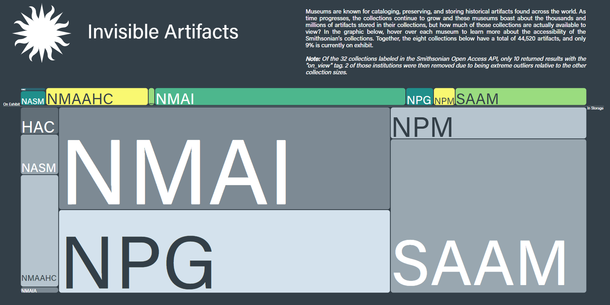

[Home](https://amina-brown.github.io) | [About Me](https://amina-brown.github.io/about_me.html) | [Resume](https://amina-brown.github.io/Resume_01_2021.pdf) | [Projects](https://amina-brown.github.io/projects.html)

## Invisible Artifacts

This project, completed in partnership with the Smithsonian Institution, consists of two versions. They both use the same dataset and explore the relationship between the artifacts 
that are on view in the museum and those away in storage. It aims to show the difference in the number of museum artifacts that are in an exhibit versus in storage across various 
institutions under the Smithsonian umbrella. Museums are often limited in what they can show by the amount of floor space, leaving the visitors to see just the tip of the iceberg.
By exploring the different institutions and the topic categorization of the artifacts, patrons interested in the Smithsonian can get a better understanding of what the museums 
have to offer and what they’ve chosen to promote. 

Version 1  
[Launch Project](https://amina-brown.github.io/major-studio-1/quantitative-project/) | [Documentation](https://github.com/amina-brown/major-studio-1/tree/master/quantitative-project)

Version 2  
[Launch Project](https://amina-brown.github.io/major-studio-1/interactive-project/) | [Documentation](https://github.com/amina-brown/major-studio-1/tree/master/interactive-project)

