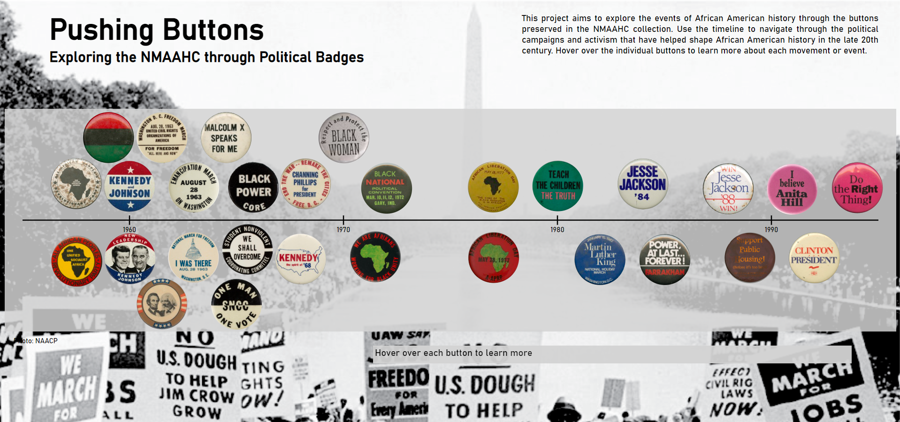

[Home](https://amina-brown.github.io) | [About Me](https://amina-brown.github.io/about_me.html) | [Resume]() | [Projects](https://amina-brown.github.io/projects.html)

## Pushing Buttons

This project, completed in partnership with the Smithsonian Institution, investigates the collection of pinback buttons in the National Museum of African American History
and Culture. The buttons are displayed on a timeline to show the visual impact they have and how political movements have used the medium from the mid-1950s on. Each button is
accompanied by a description of the associated movement and a link to more information.

[Launch Project](https://amina-brown.github.io/major-studio-1/qualitative-data/) | [Documentation](https://github.com/amina-brown/major-studio-1/tree/master/qualitative-data)

