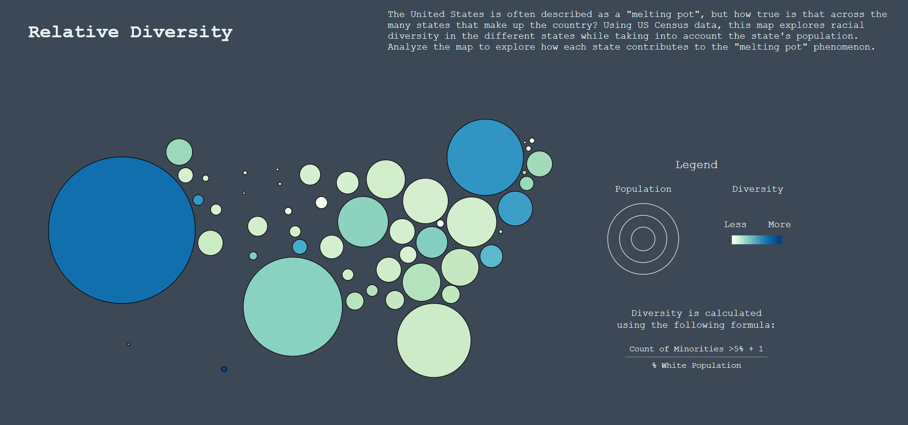

[Home](https://amina-brown.github.io) | [About Me](https://amina-brown.github.io/about_me.html) | [Resume]() | [Projects](https://amina-brown.github.io/projects.html)

## Relative Diversity

My objective for this project was to use an abstracted version of the US map, but I wanted to be sure that in representing it differently, I wasn’t compromising the geospatial 
representation. I decided to use this [version](https://bl.ocks.org/veltman/938ea2d0ef98c02633bec15d6fb3a177) which I thought was a great way to find the balance between the 
familiar Mercator projection and a Dorling cartogram. In relation to the data, I pulled a specific data set from the Census Bureau that looked at race distributions throughout 
the states. From there, I created a diversity score and used the size and color of the circles in the Dorling state to represent the population and diversity, respectively.

[Launch Project](https://amina-brown.github.io/information-aesthetics/Spatial%20Visualization/) | [Documentation](https://github.com/amina-brown/information-aesthetics/tree/gh-pages/Spatial%20Visualization)

